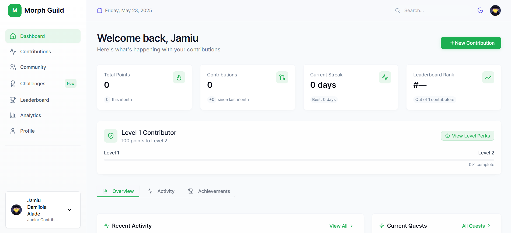

# Technical Guide: Navigating the Morph Guild Dashboard

Welcome to the Morph Guild Dashboard! This guide will help you navigate the dashboard to track your contributions, participate in challenges, engage with the community, and monitor your progress within the Morph ecosystem. The dashboard is accessible at [https://morph-guild.dev/dashboard](https://morph-guild.dev/dashboard).

## 1. Overview of the Dashboard

The Morph Guild Dashboard is designed to help contributors engage with the Morph ecosystem. It provides tools to track contributions, view community updates, participate in challenges, and analyze progress. The dashboard is divided into several tabs, accessible via the sidebar on the left.

## 2. Sidebar Navigation

The sidebar provides access to all major sections of the dashboard:

* **Dashboard**: The landing page with a welcome message and quick stats.
* **Contributions**: Track and manage your contributions.
* **Community**: Stay updated with announcements, events, and discussions.
* **Challenges**: Participate in quests and challenges.
* **Leaderboard**: View top contributors and rankings.
* **Analytics**: Monitor contribution metrics and trends.
* **Profile**: View and edit your profile details.

## 3. Dashboard Tab: Welcome and Quick Stats

The Dashboard tab greets you and provides an overview of your activity.

**Key Features:**

* **Welcome Message**: Displays your name and contributor level.
* **Stats Overview**:

  * Total Points
  * Contributions
  * Current Streak
  * Leaderboard Rank
* **Level Progress**: Shows current level and progress toward the next level.
* **Recent Activity**: Lists recent contributions or quests.
* **Recent Achievements**: Displays earned badges or achievements.

**How to Use:**

* Review stats to assess your standing.
* Check "Recent Activity" for tasks in progress.
* Click "View All" for more details.

## 4. Contributions Tab: Managing Your Contributions

Track and submit your contributions to the Morph ecosystem.

**Key Features:**

* **Stats**:

  * Total Points Earned
  * Approved Contributions
  * Pending Review
* **Contribution History**:

  * Filter by status: All, Pending, Approved, Rejected
  * Search by keywords
  * View by type (Code, Docs, Media, etc.)
* **Submit Contribution**: Use the green "Submit Contribution" button.

**How to Use:**

* Review your stats and history.
* Use filters and search to find specific entries.
* Click "+ New Contribution" to add a new item.

## 5. Community Tab: Engaging with the Morph Ecosystem

Stay connected with the community and ecosystem updates.

**Key Features:**

* **Announcements**: Important updates and guides.
* **Upcoming Events**: Scheduled events.
* **Active Contributors**: List of recent contributors.
* **Discussions**: Community discussions and threads.

**How to Use:**

* Read announcements and event info.
* Engage in discussions or start a new thread.
* Use filters and search to find specific topics.

## 6. Challenges & Quests Tab: Earning Points

Participate in challenges to earn points and advance your tier.

**Key Features:**

* **Challenges**:

  * Lists available challenges
  * Filter by "All Challenges" or "This Week"
* **Your Progress**: Track challenge completion (sign-in required)

**How to Use:**

* View available challenges.
* Sign in to track progress.
* Check back regularly for new challenges.

## 7. Leaderboard Tab: Tracking Top Contributors

See how you rank among other contributors.

**Key Features:**

* **Stats**:

  * Total Contributors
  * Total Contributions
  * Points Awarded
* **Top Contributor**: Spotlight on highest contributor
* **Leaderboard Table**:

  * Columns: Rank, Contributor, Contributions, Achievements, Points
  * Filters: "All-Time", "This Month"
  * Search bar to find names

**How to Use:**

* Check top contributors and compare stats.
* Search for specific users.
* Toggle filters to change views.

## 8. Analytics Tab: Monitoring Your Metrics

Gain insights into your contribution trends.

**Key Features:**

* **Stats**:

  * Total Contributions
  * Current Rank
  * Last Contribution Date
* **Contribution Overview**: Graph by type and time.
* **Top Categories**: Most active areas.
* **Yearly Goals**: Achievement progress.

**How to Use:**

* Review stats and trends.
* Check goals and adjust contributions accordingly.

## 9. Profile Tab: Managing Your Account

Manage your profile and track achievements.

**Key Features:**

* **Profile Info**: Name, join date, contributor level
* **Options**: Share or edit profile
* **Stats**: Points, Contributions, Streaks, Ranking, Achievements
* **Achievements**: Tabs for All, Milestones, Streaks

**How to Use:**

* Review and edit profile information.
* Track badge progress in "Achievements".

## 10. Getting Started

If you’re new:

* Visit the **Community** tab to read "How to make a contribution".
* Go to **Contributions** and click "Submit Contribution".
* Check the **Challenges** tab regularly.
* Join discussions to connect with others.

## 12. Support

Encountering issues? Ask for help in the **Community** tab or start a discussion.

---

This guide is designed to help you get the most out of the Morph Guild Dashboard. Happy contributing!
