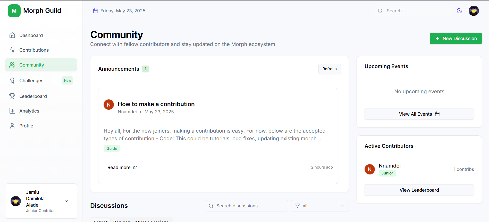

# Morph Guild Dashboard: User Onboarding Guide

Welcome to the Morph Guild. This guide provides a clear walkthrough for navigating the Morph Guild Dashboard, submitting contributions, tracking progress, and engaging with the community.

---

## Part 1: Introduction to the Morph Guild

### What Is the Morph Guild?

The Morph Guild is a community-powered platform that enables contributors—developers, writers, and creators—to support the growth of the Morph ecosystem. It offers tools for logging work, earning recognition, and collaborating with others.

### What You Can Do

- Log contributions to Morph (e.g., code, documentation, media).
- Earn points and achievements based on your impact.
- Climb the leaderboard to gain visibility.
- Participate in challenges for bonus rewards.
- Build and share a contributor profile.
- Collaborate with others on projects and initiatives.

### Contributor Progression

| Tier     | Points Required | Benefits                                      |
|----------|------------------|-----------------------------------------------|
| Novice   | 0–100            | Basic badge, forum access                     |
| Explorer | 101–500          | Access to exclusive challenges, spotlights    |
| Master   | 501+             | Priority support, event invites, mentorship   |

---

## Part 2: Navigating the Dashboard

### 1. Sign Up and Log In

- Visit [https://morph-guild.dev](https://morph-guild.dev)
- Click **"Get Started Now"** to create an account.
- Fill in your registration details.
- Log in to access the dashboard.

---

### 2. Dashboard Layout

Upon login, you'll land on the **Dashboard** tab. Use the sidebar to navigate:

- **Dashboard** – Overview and recent activity  
- **Contributions** – Submit and manage your work  
- **Community** – Interact with other contributors  
- **Challenges** – Join weekly quests  
- **Leaderboard** – View rankings  
- **Analytics** – Track your metrics  
- **Profile** – Manage personal info and achievements  

---

## Part 3: Core User Flows

### 3. Submitting a Contribution

- Go to the **Contributions** tab.
- Click **"+ New Contribution"**.
- Select a category:
  - **Code** – For repositories, pull requests, etc.
  - **Docs** – For written guides, technical writing
  - **Media** – For videos, designs, and visual content
- Upload or link your work.
- Add a concise description.
- Click **"Submit Contribution"**.

Track submission status under **Contribution History**:
- Pending  
- Approved  
- Rejected  

  

---

### 4. Participating in Challenges

- Click the **Challenges** tab.
- Browse current or weekly challenges.
- Select a challenge and follow the instructions.
- Complete the related task.
- Submit your work via the **Contributions** tab (mention the challenge).
- Track progress under **Your Progress**.

---

### 5. Engaging with the Community

- Go to the **Community** tab.
- Read announcements and upcoming events.
- Join or start discussions.
- Use filters to sort content.
- View **Active Contributors** to see top participants.

---

### 6. Climbing the Leaderboard

- Navigate to the **Leaderboard** tab.
- Toggle between **All-Time** and **This Month** rankings.
- Use the search bar to find specific users.
- Track rankings based on points, achievements, and contributions.

---

### 7. Tracking Progress with Analytics

- Open the **Analytics** tab.
- Review your:
  - Total Contributions
  - Current Rank
  - Last Contribution
- View the **Contribution Overview** graph.
- Check progress in the **Yearly Goals** section.

---

### 8. Managing Your Profile

- Click the **Profile** tab.
- Review:
  - Total Points
  - Contributions
  - Weekly Streaks
  - Rank
- Explore the **Achievements** section:
  - All
  - Milestones
  - Streaks
- Click **Edit Profile** to update your bio, skills, or avatar.
- Use **Share Profile** to promote your activity.

---

### 9. Advancing Contributor Tiers

- Earn points by submitting contributions and completing challenges.
- Tier progression:
  - **Novice** → **Explorer** → **Master**
- Each tier unlocks new features and visibility.
- Monitor your tier progress on the **Dashboard**.

---

### 10. Collaborating with Others

- Use the **Community** tab to connect with collaborators.
- Join or start discussions for group contributions.
- Coordinate tasks and submit work as a team.

---

## Part 4: Tips for Effective Contribution

- Contribute consistently to maintain streaks and gain more points.
- Join challenges weekly for visibility and bonuses.
- Engage in discussions to grow your network.
- Use Analytics to set goals and track progress.
- Collaborate for high-impact contributions.

---

## Part 5: Support & Resources

- Visit the **Community** tab for support and FAQs.
- Check the **Announcements** section for platform updates.
- Explore more at [https://morph-guild.dev](https://morph-guild.dev)

---

## Get Started

Ready to contribute?

✅ Log in  
✅ Submit your first contribution  
✅ Join a challenge  
✅ Track your rank  
✅ Share your impact

---

**Welcome to the Morph Guild — your journey as a contributor starts here.**
